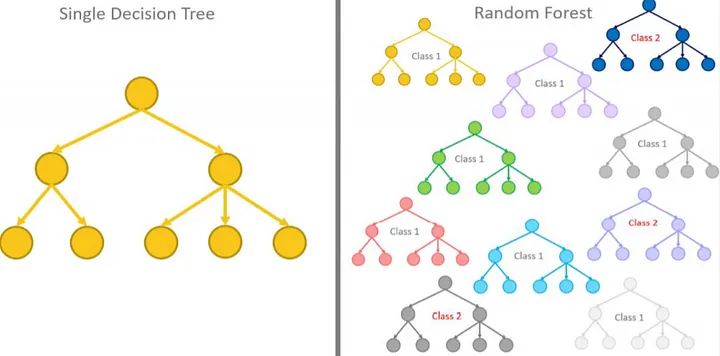

## 4. Bölüm 4.2 : Sınıflandırma

Sınıflandırma

      Tanım: Sınıflandırma, girdi verilerini önceden tanımlanmış bir dizi kategoriye (sınıf veya etiket) atayan bir 
      makine öğrenmesi türüdür. Model, giriş verilerinin sınıflandırılması için eğitilir.
      Örnek: E-posta spam filtreleme, el yazısı tanıma, tıbbi teşhis.
      Algoritmalar: Lojistik regresyon, destek vektör makineleri, karar ağaçları, rastgele ormanlar, yapay sinir ağları.

Sınıflandırma için örnek kod: Bu kod örneğinde, Iris veri seti yüklenir, veri önişleme yapılır (standart ölçeklendirme) ve eğitim ve test setlerine ayrılır. Daha sonra, destek vektör makineleri (SVC) sınıflandırma modeli oluşturulur ve eğitilir. Son olarak, test verileri üzerinde tahmin yapılır ve modelin performansı değerlendirilir.

      # Gerekli kütüphanelerin yüklenmesi
      from sklearn.datasets import load_iris
      from sklearn.model_selection import train_test_split
      from sklearn.preprocessing import StandardScaler
      from sklearn.svm import SVC
      from sklearn.metrics import accuracy_score, classification_report
      
      # Veri setini yükleme
      iris = load_iris()
      X = iris.data
      y = iris.target
      
      # Veriyi eğitim ve test setlerine ayırma
      X_train, X_test, y_train, y_test = train_test_split(X, y, test_size=0.3, random_state=42)
      
      # Veri önişleme (standart ölçeklendirme)
      scaler = StandardScaler()
      X_train = scaler.fit_transform(X_train)
      X_test = scaler.transform(X_test)
      
      # Destek Vektör Makineleri (Support Vector Classifier) modeli oluşturma ve eğitme
      svm_model = SVC(kernel='linear', random_state=42)
      svm_model.fit(X_train, y_train)
      
      # Test verileri üzerinde tahmin yapma
      y_pred = svm_model.predict(X_test)
      
      # Model performansının değerlendirilmesi
      accuracy = accuracy_score(y_test, y_pred)
      print("Doğruluk (Accuracy): {:.2f}%".format(accuracy * 100))
      
      # Sınıflandırma raporunun görüntülenmesi
      print("\nSınıflandırma Raporu:\n", classification_report(y_test, y_pred))
