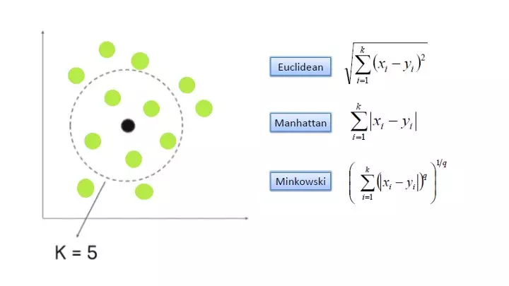

## 4. Bölüm 4.4 : K-En Yakın Komşu

K-En Yakın Komşu (K-Nearest Neighbors, KNN)

      Tanım: K-En Yakın Komşu, sınıflandırma ve regresyon problemleri için kullanılan basit bir makine öğrenmesi algoritmasıdır. 
      Bir örneği sınıflandırmak veya tahmin etmek için, çevresindeki en yakın k veri noktasının etiketleri 
      veya değerleri kullanılır.
      Örnek: Tavsiye sistemleri, hastalık teşhisi, görüntü tanıma.
      Algoritmalar: KNN.

K-En Yakın Komşu için örnek kod: Bu kod örneğinde, Iris veri seti yüklenir, veri önişleme yapılır (standart ölçeklendirme) ve eğitim ve test setlerine ayrılır. Daha sonra, K-En Yakın Komşu (KNN) sınıflandırma modeli oluşturulur ve eğitilir. Test verileri üzerinde tahmin yapılır ve modelin performansı değerlendirilir.

      # Gerekli kütüphanelerin yüklenmesi
      from sklearn.datasets import load_iris
      from sklearn.model_selection import train_test_split
      from sklearn.preprocessing import StandardScaler
      from sklearn.neighbors import KNeighborsClassifier
      from sklearn.metrics import accuracy_score, classification_report
      
      # Veri setini yükleme
      iris = load_iris()
      X = iris.data
      y = iris.target
      
      # Veriyi eğitim ve test setlerine ayırma
      X_train, X_test, y_train, y_test = train_test_split(X, y, test_size=0.3, random_state=42)
      
      # Veri önişleme (standart ölçeklendirme)
      scaler = StandardScaler()
      X_train = scaler.fit_transform(X_train)
      X_test = scaler.transform(X_test)
      
      # K-En Yakın Komşu modeli oluşturma ve eğitme
      knn_model = KNeighborsClassifier(n_neighbors=5)
      knn_model.fit(X_train, y_train)
      
      # Test verileri üzerinde tahmin yapma
      y_pred = knn_model.predict(X_test)
      
      # Model performansının değerlendirilmesi
      accuracy = accuracy_score(y_test, y_pred)
      print("Doğruluk (Accuracy): {:.2f}%".format(accuracy * 100))
      
      # Sınıflandırma raporunun görüntülenmesi
      print("\nSınıflandırma Raporu:\n", classification_report(y_test, y_pred))
