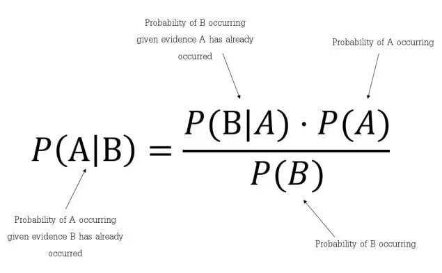

## 4. Bölüm 4.6 : Naive Bayes

Naive Bayes

      Tanım: Naive Bayes, sınıflandırma problemleri için kullanılan olasılıklı bir makine öğrenmesi algoritmasıdır. 
      Naive Bayes, Bayes teoremi ve öznitelikler arasındaki bağımsızlık varsayımı temelinde çalışır.
      Örnek: Spam filtreleme, duygu analizi, metin sınıflandırma.
      Algoritmalar: Gaussian Naive Bayes, Multinomial Naive Bayes.

Naive Bayes için örnek kod: Bu kod örneğinde, Iris veri seti yüklenir ve veri eğitim ve test setlerine ayrılır. Daha sonra, Naive Bayes sınıflandırma modeli oluşturulur (burada Gaussian Naive Bayes kullanılmıştır) ve eğitilir. Test verileri üzerinde tahmin yapılır ve modelin performansı değerlendirilir.

      # Gerekli kütüphanelerin yüklenmesi
      from sklearn.datasets import load_iris
      from sklearn.model_selection import train_test_split
      from sklearn.naive_bayes import GaussianNB
      from sklearn.metrics import accuracy_score, classification_report
      
      # Veri setini yükleme
      iris = load_iris()
      X = iris.data
      y = iris.target
      
      # Veriyi eğitim ve test setlerine ayırma
      X_train, X_test, y_train, y_test = train_test_split(X, y, test_size=0.3, random_state=42)
      
      # Naive Bayes modeli oluşturma ve eğitme
      nb_model = GaussianNB()
      nb_model.fit(X_train, y_train)
      
      # Test verileri üzerinde tahmin yapma
      y_pred = nb_model.predict(X_test)
      
      # Model performansının değerlendirilmesi
      accuracy = accuracy_score(y_test, y_pred)
      print("Doğruluk (Accuracy): {:.2f}%".format(accuracy * 100))
      
      # Sınıflandırma raporunun görüntülenmesi
      print("\nSınıflandırma Raporu:\n", classification_report(y_test, y_pred))
